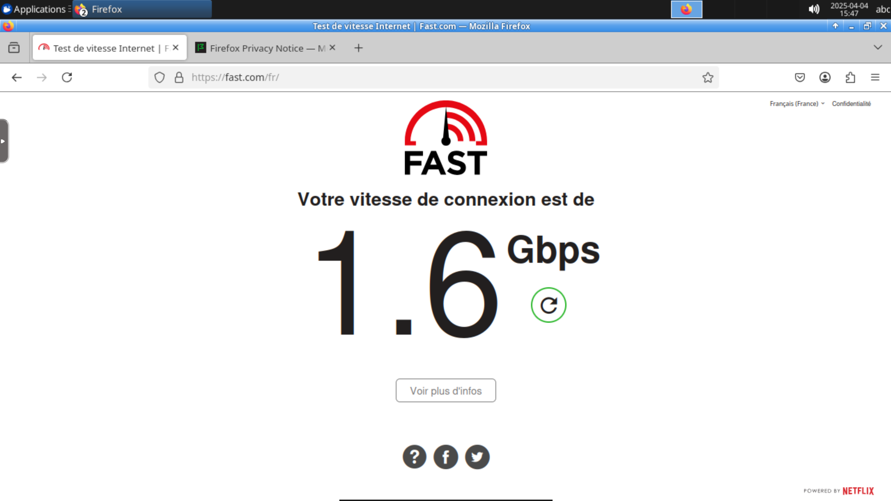

# free-RDP-google
free RDP from google 50 h / week

# Cloud Shell Linux Desktops via Docker

Ce dépôt contient un guide pour lancer rapidement des environnements de bureau Linux (LXDE ou XFCE) directement depuis Google Cloud Shell en utilisant Docker. Cela permet d'accéder à une interface graphique avec des applications comme un navigateur web, bénéficiant de la puissante connexion internet de Google Cloud, sans avoir besoin de configurer une machine virtuelle complète.


*Capture d'écran montrant un bureau Linux (probablement XFCE via Webtop) s'exécutant dans Cloud Shell, avec Firefox ouvert sur un test de vitesse internet affichant environ 1.6 Gbps.*

---

## Table des Matières

*   [Prérequis](#prérequis)
*   [Instructions d'Utilisation](#instructions-dutilisation)
    *   [Option 1 : Bureau Ubuntu LXDE Léger (Image `dorowu`)](#option-1--bureau-ubuntu-lxde-léger-image-dorowu)
    *   [Option 2 : Bureau Ubuntu XFCE Moderne (Image `linuxserver/webtop` - Recommandé)](#option-2--bureau-ubuntu-xfce-moderne-image-linuxserverwebtop---recommandé)
*   [Gestion des Conteneurs](#gestion-des-conteneurs)
*   [Pourquoi cette approche ?](#pourquoi-cette-approche-)
*   [Licence](#licence)

---

## Prérequis

1.  **Compte Google Cloud :** Vous devez avoir accès à Google Cloud Platform.
2.  **Projet GCP :** Un projet Google Cloud actif.
3.  **Cloud Shell :** Savoir comment ouvrir et utiliser le terminal Cloud Shell intégré.

---

## Instructions d'Utilisation

### Étape 1 : Ouvrir Cloud Shell

Connectez-vous à [Google Cloud Console](https://console.cloud.google.com/) et cliquez sur l'icône **"Activer Cloud Shell"** (`>_`) en haut à droite.

### Étape 2 : Choisir et Lancer un Conteneur de Bureau

Choisissez l'une des options ci-dessous en fonction de vos besoins. Copiez et collez la commande correspondante dans votre terminal Cloud Shell.

#### Option 1 : Bureau Ubuntu LXDE Léger (Image `dorowu`)

*   **Description :** Très léger, démarrage rapide. Idéal pour des tâches simples. Les logiciels (ex: Firefox) peuvent être anciens.
*   **Commande :**
    ```bash
    docker run -d --name lxde-desktop -p 6070:80 dorowu/ubuntu-desktop-lxde-vnc
    ```
*   **Accès :**
    1.  Attendez quelques secondes.
    2.  Cliquez sur l'icône **"Aperçu sur le Web"** dans Cloud Shell.
    3.  Sélectionnez **"Prévisualiser sur le port 6070"**.
    4.  Un onglet s'ouvre sur une interface VNC. Le mot de passe par défaut est souvent `vncpassword`.

#### Option 2 : Bureau Ubuntu XFCE Moderne (Image `linuxserver/webtop` - Recommandé)

*   **Description :** Base Ubuntu plus récente, environnement XFCE, navigateurs à jour. Excellent équilibre entre fonctionnalités et légèreté. C'est cette option qui permet généralement d'obtenir les excellentes vitesses de connexion visibles sur la capture d'écran.
*   **Commande :**
    ```bash
    docker run -d \
      --name=webtop-ubuntu-xfce \
      -p 6070:3000 \
      -e PUID=1000 \
      -e PGID=1000 \
      -e TZ=Etc/UTC \
      --shm-size="1gb" \
      --security-opt seccomp=unconfined \
      --restart unless-stopped \
      lscr.io/linuxserver/webtop:ubuntu-xfce
    ```
*   **Accès :**
    1.  Attendez quelques instants (le premier démarrage peut prendre une minute).
    2.  Cliquez sur l'icône **"Aperçu sur le Web"** dans Cloud Shell.
    3.  Sélectionnez **"Prévisualiser sur le port 6070"**.
    4.  Le bureau XFCE s'affiche directement dans l'onglet (généralement sans mot de passe).

---

## Gestion des Conteneurs

Utilisez ces commandes Docker dans Cloud Shell pour gérer vos bureaux virtuels :

*   **Lister les conteneurs actifs :**
    ```bash
    docker ps
    ```
*   **Lister tous les conteneurs (actifs et arrêtés) :**
    ```bash
    docker ps -a
    ```
*   **Arrêter un conteneur :**
    ```bash
    # Pour l'option 1
    docker stop lxde-desktop
    # Pour l'option 2
    docker stop webtop-ubuntu-xfce
    ```
*   **Démarrer un conteneur arrêté :**
    ```bash
    # Pour l'option 1
    docker start lxde-desktop
    # Pour l'option 2
    docker start webtop-ubuntu-xfce
    ```
*   **Supprimer un conteneur (attention, les données non sauvegardées sont perdues !) :**
    ```bash
    # Arrêter le conteneur d'abord (voir ci-dessus)
    # Puis supprimer :
    docker rm lxde-desktop
    docker rm webtop-ubuntu-xfce
    ```
*   **Voir les logs d'un conteneur (utile pour le débogage) :**
    ```bash
    docker logs webtop-ubuntu-xfce
    # ou pour suivre les logs en direct:
    docker logs -f webtop-ubuntu-xfce
    ```

---

## Pourquoi cette approche ?

*   **Rapidité :** Lancez un environnement graphique en quelques secondes/minutes.
*   **Simplicité :** Pas de gestion complexe de VM ou de pare-feu (pour l'accès de base via Web Preview).
*   **Performance Réseau :** Profitez de la connexion Internet très haut débit de Google Cloud directement depuis le navigateur dans le conteneur (comme le montre la vitesse de 1.6 Gbps).
*   **Isolation :** Les conteneurs Docker fournissent un environnement isolé.
*   **Gratuité (dans les limites de Cloud Shell) :** L'utilisation de Cloud Shell est gratuite dans ses limites d'usage.

---

## Licence

Ce guide est fourni sous Apache-2.0 license.
